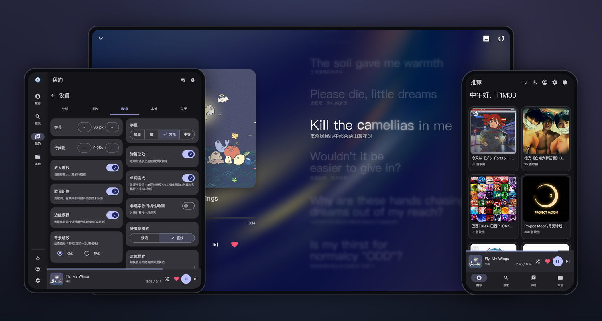
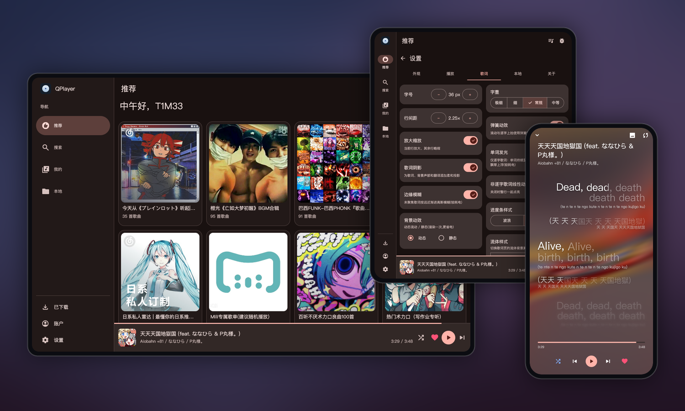

<p align="center">
  
</p>

<h1 align="center">QPlayer</h1>

<p align="center">
  <b>简体中文</b> · <a href="README.en.md">English</a>
</p>

<p align="center">
  <b>一个界面由 QML 渲染的跨平台网易云音乐播放器</b><br>
  由 <a href="https://github.com/TIMER-err/qml4j">qml4j</a> 强力驱动
</p>

<p align="center">
  
  
  
  
  <a href="LICENSE.md"></a>
</p>

---

<p align="center">
  
</p>
<p align="center">
  <sub>手机推荐 · 平板设置 · 桌面歌词</sub>
</p>
<p align="center">
  
</p>
<p align="center">
  <sub>桌面推荐 · 平板设置 · 手机歌词</sub>
</p>

界面不使用任何原生 View。除歌词页正文外,所有控件都由 QML 描述并经 qml4j 渲染;歌词正文(逐字滚动 + 流体背景)由宿主通过 Skija 直接手工绘制,不走 QML。qml4j 本身是用纯 Java 实现的 QML 运行时。

<a href="https://www.star-history.com/?repos=TIMER-err%2Fqplayer&type=date&legend=top-left">
 <picture>
   <source media="(prefers-color-scheme: dark)" srcset="https://api.star-history.com/chart?repos=TIMER-err/qplayer&type=date&theme=dark&legend=top-left&sealed_token=pvVKTlOWl7Lak9qFpFBXwrZXczfPyNb2ZD6ZbfiJY2us9fPe7ck5CffvPIOKcTPhT9B6J92c16ce9UrxUIJ-hwpT4WlDEdPJJ5MFvDSvK9CTG1wry56KYPc0OyDhCujlPX35c-dFPj9xU7IqhAEkH6Xz3Q13--zsYmcC_WLSYtiPKr_Et0O9x5sj-mZr" />
   <source media="(prefers-color-scheme: light)" srcset="https://api.star-history.com/chart?repos=TIMER-err/qplayer&type=date&legend=top-left&sealed_token=pvVKTlOWl7Lak9qFpFBXwrZXczfPyNb2ZD6ZbfiJY2us9fPe7ck5CffvPIOKcTPhT9B6J92c16ce9UrxUIJ-hwpT4WlDEdPJJ5MFvDSvK9CTG1wry56KYPc0OyDhCujlPX35c-dFPj9xU7IqhAEkH6Xz3Q13--zsYmcC_WLSYtiPKr_Et0O9x5sj-mZr" />
   
 </picture>
</a>

## 特性

- 端到端播放:基于网易云音乐 API,覆盖推荐、搜索、用户歌单、最近播放与本地文件。
- 扫码登录,喜欢与取消喜欢,播放队列,三种播放模式(列表循环、随机、单曲循环)。
- 网易云一起听:支持创建房间、通过邀请链接加入和恢复未结束的房间;同步双方播放队列、歌曲、播放/暂停状态与进度,并在对方切歌、调整进度或改变播放状态时显示提示。
- 心动推荐:以“我喜欢的音乐”和当前歌曲为上下文生成推荐队列,可从歌单页直接开始播放。
- 自动换源:灰色、VIP、仅试听的曲目按歌名与歌手匹配替代音源,在播放前完成切换(可关闭)。
- 歌词页:由宿主直接通过 Skija 绘制。逐字滚动(优先 AMLL TTML,网易云作为回退),基于封面取色的流体背景,罗马音与翻译,Material 波浪进度条;支持拖动滚动、释放后惯性滑动与点击行跳转。
- Material 3 界面:整套 UI 为 QML(`md3.Core`),运行在 qml4j 引擎上。
- 莫奈动态取色:主题色从当前封面提取(可关闭);支持深色、浅色与跟随系统。
- 系统媒体控件与后台播放:前台 `MediaSession` 服务接管锁屏、通知栏与蓝牙控制,处理自动续播、进度同步、来电暂停与失焦降音。
- 响应式布局:界面随窗口/屏幕宽度自适应(MD3 断点 600 / 840)——窄屏底部导航,宽屏切换为左侧 `NavigationRail`,歌单栅格列数随宽度增减。这套布局是宽度驱动的,安卓横屏与平板同样生效。
- 桌面端(LWJGL3):同一套 QML 与 `player-core` 逻辑跑在桌面,GLFW 开窗、Skija 渲染。**OpenGL / Vulkan 图形后端可在启动时切换**;任务栏图标 + 系统托盘,托盘菜单镜像播放控制;**最小化到托盘时销毁渲染线程与 GPU 资源,恢复时重建**(播放与界面状态保留)。

## 凭据存储与安全边界

QPlayer 使用带完整性验证的 AES-GCM 加密网易云登录 Cookie,并尽可能通过 Android Keystore、macOS Keychain、Windows DPAPI 或 Linux Secret Service/KWallet 保护随机数据密钥。系统密码库不可用时,用户可以明确选择回退到仅当前用户可读的本地密钥。

这项功能的目标是**静态文件保护**,而不是本机恶意软件防护。它可以降低凭据文件、配置目录、备份或旧硬盘被单独复制后直接恢复登录状态的风险,也可阻止其他未提权系统账户直接读取凭据。

> [!IMPORTANT]
> Windows DPAPI 和 Linux Secret Service/KWallet 主要以当前用户/登录会话为安全边界,不保证 QPlayer 独占访问。以同一用户身份运行的其他程序可能调用相同系统接口;在密码库已解锁时尤其如此。普通加密回退模式在桌面端主要依赖文件权限,也不能防御同用户程序。Android 应用沙箱和 macOS Keychain 应用访问控制提供了更强的应用级隔离,但 root/管理员权限、进程注入、调试或读取 QPlayer 运行时内存仍不在保护范围内。

## 仓库结构

| 模块 | 说明 |
|---|---|
| `player-core/` | 跨平台核心(Maven,`dev.t1m3.qplayer`):面向 QML 的 `PlayerController`、网易云 API、歌词解析(LRC / YRC / TTML)、音频与元数据抽象,以及宿主绘制的歌词页(流体 SkSL 背景 + 逐字渲染器 + `LyricCompositor` 三层合成)。安卓壳与桌面宿主共用,两端歌词渲染完全一致。 |
| `shared-qml/` | 共享 QML:`Main.qml` + 各页面 + 组件,vendored 的 `md3.Core` 组件库,以及内置字体(PingFang / Material Symbols)。位于仓库根目录,安卓与桌面加载同一份(响应式布局因此两端通用)。 |
| `android-shell/` | 安卓应用(Gradle,`applicationId dev.t1m3.qplayer`,minSdk 26)。宿主集成位于 `…/android/`;UI 与歌词均来自上面两个共享模块。 |
| `desktop-host/` | 桌面宿主(Maven):LWJGL3 + GLFW 开窗、Skija 渲染,可切换的 `GraphicsBackend`(`GLBackend` / `VulkanBackend`)、可销毁/重建的渲染线程、系统托盘,以及桌面音频(javax.sound + SPI 解码)。 |
| [qml4j](https://github.com/TIMER-err/qml4j) | QML 引擎。一个已发布的依赖,**不在**本仓库内。 |

`qml4j-core` 从 Maven Central 解析;本地构建仓库内的 `player-core` / `desktop-host` 模块。

## 构建

需要 JDK 21;构建安卓还需 Android SDK。

**安卓**

```sh
# 将共享模块安装到 Maven Local(安卓壳通过 mavenLocal 消费)
mvn -q -pl player-core -am install

# 构建 APK(qml4j-core 从 Maven Central 解析)
cd android-shell && ./gradlew :app:assembleDebug
# → app/build/outputs/apk/debug/app-debug.apk
```

**桌面**

```sh
# 构建一次(player-core / desktop-host)
mvn -q -pl player-core,desktop-host -am install

# 运行(默认 OpenGL)
mvn -pl desktop-host exec:exec

# 切 Vulkan 后端 / 指定初始窗口大小(试响应式断点)
mvn -pl desktop-host exec:exec -Dgfx=vulkan
mvn -pl desktop-host exec:exec -Dwin.w=480 -Dwin.h=800   # 窄屏(底部导航)
```

> 关闭按钮最小化到托盘(渲染线程销毁、音频续播),从托盘"退出"才真正退出。macOS 启动需加 `-XstartOnFirstThread`。

**桌面分发包(jpackage + jlink)**

需要完整的 **JDK 21**(非 JRE,要带 `jpackage`/`jlink`)。产物内置一个按需裁剪的 JRE,用户无需自行安装 Java。`jpackage` 只能为当前系统打包,**每个平台需在对应机器上构建**。

```sh
# 1) 安装共享模块
mvn -DskipTests -pl player-core -am install

# 2) 组装 target/app(qplayer.jar + lib/ 下的全部运行时依赖)
mvn -DskipTests -pl desktop-host -Pdist package

# 3) 打成各平台分发包(jpackage 顺带 jlink 出运行时)
bash       desktop-host/dist/package-linux.sh      # Linux   → target/QPlayer-x86_64.AppImage(单文件)
pwsh -File desktop-host/dist/package-windows.ps1   # Windows → target/QPlayer-windows-x64.zip
bash       desktop-host/dist/package-macos.sh      # macOS   → target/QPlayer.dmg(随当前架构)
```

> 裁进运行时的 JDK 模块列表在 `desktop-host/dist/jre-modules.txt`,三个脚本共用。macOS 的 `.dmg` 未签名,对外分发需自行 codesign + 公证,否则 Gatekeeper 会拦截。打 `v*` tag 时,`.github/workflows/release.yml` 会在三平台 CI 上自动完成上述构建并附到 GitHub Release。

## 发版

版本号在**两处**,bump 时都要改(保持一致):

- `android-shell/app/build.gradle.kts` —— `versionCode`(整数,每次 +1)+ `versionName`(如 `0.8.4`)
- `desktop-host/pom.xml` —— `<qplayer.app.version>`(桌面分发包版本)

改完提交,再打并推 `v<versionName>` tag(如 `v0.8.4`)触发 `release.yml`:安卓签名 APK + 三平台桌面包自动构建并附到 GitHub Release。CI 会按 `build.gradle.kts` 里的 `qml4j-core` 版本从源码 clone 对应 `v*` tag 构建引擎。

## 致谢

- [qml4j](https://github.com/TIMER-err/qml4j) —— 运行整个界面的纯 Java QML 引擎。
- [Skija](https://github.com/HumbleUI/Skija) —— JVM 上的 Skia 绑定;渲染器与宿主绘制的歌词页都通过它输出。
- [material-components-qml](https://github.com/sudoevolve/material-components-qml) —— UI 所用的 Material 3 QML 组件库(`md3.Core`,vendored 后适配引擎)。
- [SPlayer](https://github.com/imsyy/SPlayer) —— 流体歌词背景的视觉与实现参考。
- [AMLL](https://github.com/amll-dev/amll-player) —— Apple Music 风格歌词与流体背景的设计参考。
- [AMLL TTML DB](https://github.com/Steve-xmh/amll-ttml-db) —— 逐字歌词。
- [NeteaseCloudMusicApiEnhanced](https://github.com/NeteaseCloudMusicApiEnhanced/api-enhanced) —— 网易云请求加密方案(weapi/eapi/xeapi)的算法参照。
- [swingwebview](https://github.com/webliteca/swingwebview) —— 桌面端调用系统 WebView 完成网页登录。
- 图标使用 Material Symbols Rounded。

> 个人与学习项目。网易云音乐是其各自所有者的商标
> 本应用为非官方客户端,与网易云无关联。

## 许可证

[Apache License 2.0](LICENSE.md)。
